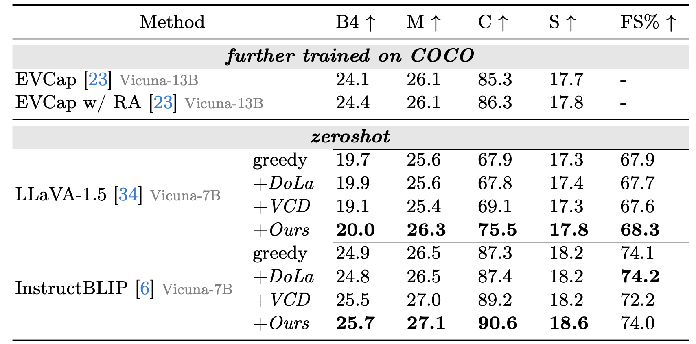
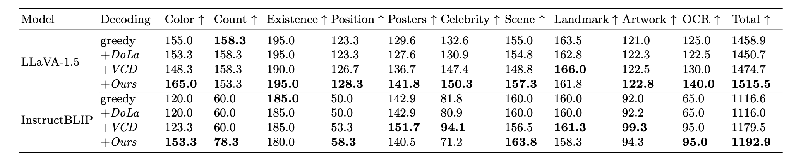
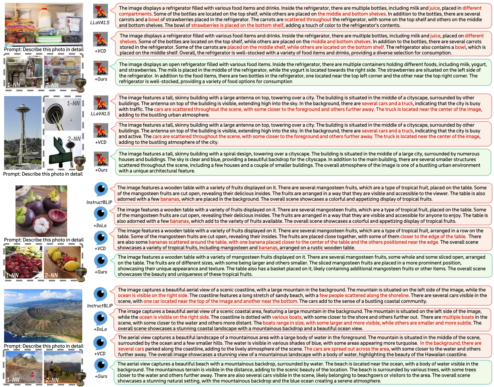

<p align="center" width="100%">
<a target="_blank"></a>
</p>

# Pensieve: Retrospect-then-Compare mitigates Visual Hallucination

## 🙋🏽 Introduction
This is the official repo of our work "Pensieve", a training free method to mitigate visual hallucination in Multi-modal LLMs. 

**Visual Hallucination** refers to the issue that MLLMs inaccurately describe the visual inputs, generating conflicting or fabricated content that diverges from the provided image, as well as neglecting crucial visual details (see the above examples in the image). This issue hinders MLLMs' deployment in safety-critical applications (such as autonomous driving, clinic scenario, etc.).

Our investigation on visual hallucination suggests a different perspective: the MLLMs might **not** be entirely oblivious to accurate visual cues when they hallucinate. Inspired by this, we try to elicit accurate image descriptions from a non-blind MLLM, which is a crucial initial step in mitigating visual hallucination. We make our source code for visual hallucination analysis, reference database construction, and our proposed decoding strategy publicly available in this repo.

## 🪜 Updates
- [2024-04-27]: 🧑🏻‍💻👩🏼‍💻 Our code is released.
- [2024-03-21]: 🎉🎉 Our [Paper](https://arxiv.org/abs/2403.14401) is available on Arxiv.

## 🖼️ Overview

- We introduce Pensieve, **a plug-and-play and training-free** method to mitigate visual hallucination and enhance the specificity of image descriptions.
- During inference, MLLMs are enabled to retrospect relevant images as references from a pre-built non-parametric vector database.
- Contrasting with the visual references (resembling the "spot-the-difference" game) can help MLLMs distinguish accurate visual cues.

## 🎮 Get started

### 1. Environment Setup
We use PyTorch and the Huggingface 🤗 Transformers Library. We acknowledge their great contributions!
```bash
conda create -yn pensieve python=3.9
conda activate pensieve
git clone https://github.com/DingchenYang99/Pensieve.git
cd Pensieve
pip install -r requirements.txt
```

### 2. Download Datasets
#### COCO dataset: 
We use the COCO Caption dataset to build our reference dataset. You may DIY your own reference dataset with your in-door data as well.
- Download the Karpathy splits caption annotation `dataset_coco.json` from [here](https://www.kaggle.com/datasets/shtvkumar/karpathy-splits), and assign `/path/to/your/dataset_coco.json` in `/Pensieve/source/rag/build_index.py`.
- Download COCO images (train, val and test, 2017) from [here](https://cocodataset.org/#download). Unzip the images and assign `/path/to/your/coco/images/` in inference scripts.
#### Whoops Dataset:
- Download the Whoops dataset from [here](https://huggingface.co/datasets/nlphuji/whoops), and assign `/path/to/your/whoops/` in inference scripts.
#### MME Benchmark:
- Download the MME dataset from  [here](https://github.com/BradyFU/Awesome-Multimodal-Large-Language-Models/tree/Evaluation), and assign `/path/to/your/mme/` in inference scripts.
#### POPE Benchmark:
- Question files are in `/Pensieve/source/data/POPE/`
#### LLaVA Bench:
- Download the LLaVA-Bench in the Wild from [here](https://huggingface.co/datasets/liuhaotian/llava-bench-in-the-wild), and assign `/path/to/your/llava-bench/` in inference scripts.
### 3. Prepare Models
- Prepare LLaVA-1.5 from [here](https://huggingface.co/liuhaotian/llava-v1.5-7b), and assign `/path/to/your/llava-v1.5-7b` in inference scripts.
- Prepare InstructBLIP follow [their instruction](https://github.com/salesforce/LAVIS/tree/main/projects/instructblip). We use [Vicuna7b-v1.1](https://huggingface.co/lmsys/vicuna-7b-v1.1). Assign `/path/to/your/vicuna-7b-v1.1` in `Pensieve/source/lavis/configs/models/blip2/blip2_instruct_vicuna7b.yaml`. 
- Prepare Bert from [here](https://huggingface.co/google-bert/bert-base-uncased) and assign `/path/to/your/bert-base-uncased/` in `/Pensieve/source/lavis/models/blip2_models/blip2.py`
- OFA models will be downloaded automatically from Modelscope when running `/Pensieve/source/faithscore/calculate_whoops_faithscore.py`
- Prepare CLIP-ViT from [here](https://huggingface.co/openai/clip-vit-large-patch14), DINOv2-ViT from [here](https://github.com/facebookresearch/dinov2) and assign `/path/to/your/clip/dir/` & `/path/to/your/.cache/torch/hub/facebookresearch/dinov2/` in `/Pensieve/source/rag/build_index.py` and `/Pensieve/source/rag/retrieve_neighbours.py`

### 4. Build the Reference Database
We pre-retrieve visual references before MLLMs' inference stage.
- run the script `/Pensieve/source/rag/build_index.py` to build the reference database.
- run the script `/Pensieve/source/rag/retrieve_neighbours.py` to retrieve references for each samples in all test datasets. The file path of visual references is written to a `json` file, which is loaded in before inference.

### 5. Evaluation Metrics
- Prepare the coco caption evaluation suite from [here](https://github.com/tylin/coco-caption/tree/master) for image captioning metrics.
- Prepare the [FaithScore](https://github.com/bcdnlp/FAITHSCORE) for visual hallucination evaluation. Note: we don not use LLaVA-1.5 for evaluation as we are accessing visual hallucination for LLaVA-1.5-7B.

### 6. Run Inference
- Inference scripts can be found at `/Pensieve/source/evaluation`.
- To reproduce the results of our analysis for visual hallucination, set `save_logits` to `True` in `/Pensieve/source/evaluation/whoops_caption_llava_rancd.py`. This will save all predicted logit distributions for each decoded token. Then, run `/Pensieve/source/evaluation/eval_whoops_visual_influence.py` and `/Pensieve/source/evaluation/eval_whoops_nns_influence.py` to see whether MLLMs are blind amidst visual hallucination, and analogous visual hallucinations among similar images.
- You can get quantitative results on POPE with `/Pensieve/source/evaluation/calculate_pope.py`, and results on MME with `/Pensieve/source/evaluation/calculate_mme.py`.
## 🏅 Experiments
### Quantitative Results on Whoops

### Quantitative Results on MME

### Qualitative Results on LLaVA-Bench in the Wild

## 🔗 Related Projects
Our project is built upon VCD. We sincerely acknowledge the great contribution of the following works:
- [VCD](https://github.com/DAMO-NLP-SG/VCD): Mitigating Object Hallucinations in Large Vision-Language Models through Visual Contrastive Decoding
- [DOLA](https://github.com/salesforce/LAVIS/tree/main/projects/instructblip): Decoding by Contrasting Layers Improves Factuality in Large Language Models
- [FaishScore](https://github.com/bcdnlp/FAITHSCORE): Evaluating Hallucinations in Large Vision-Language Models
- [LLaVA-1.5](https://github.com/haotian-liu/LLaVA): Improved Baselines with Visual Instruction Tuning
- [InstructBLIP](https://github.com/salesforce/LAVIS/tree/main/projects/instructblip): Towards General-purpose Vision-Language Models with Instruction Tuning

## 📑 Citation
If you find our project useful, please consider citing our paper:
```
@article{yang2024pensieve,
  title={Pensieve: Retrospect-then-Compare Mitigates Visual Hallucination},
  author={Yang, Dingchen and Cao, Bowen and Chen, Guang and Jiang, Changjun},
  journal={arXiv preprint arXiv:2403.14401},
  year={2024}
}
```