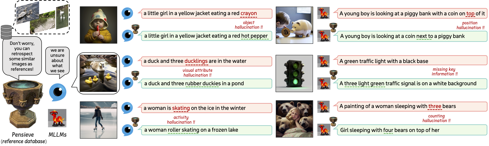
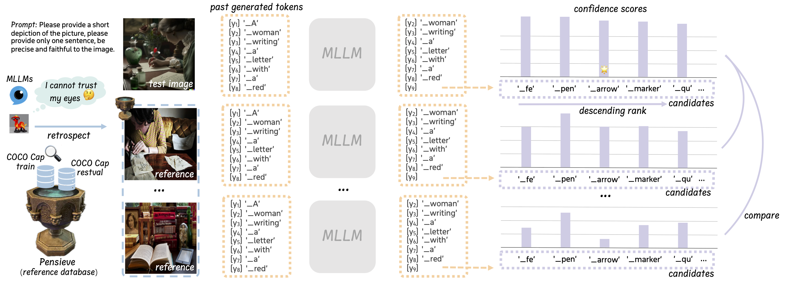

<p align="center" width="100%">
<a target="_blank"></a>
</p>

# Pensieve: Retrospect-then-Compare mitigates Visual Hallucination
This is the official repo of our work "Pensieve", a training free method to mitigate visual hallucination in Multi-modal LLMs.

## 🪜 Updates
- [2024-04-27]: 🧑🏻‍💻👩🏼‍💻 Code Release!
- [2024-03-21]: 🎉🎉 Our [Paper](https://arxiv.org/abs/2403.14401) is available on Arxiv.

## 🖼️ Overview

- We introduce Pensieve, **a plug-and-play and training-free** method to mitigate visual hallucination and enhance the specificity of image descriptions.

## 🎮 Get started

### 1. Environment Setup

### 2. Download Datasets

### 3. Download Models

### 4. Prepare Pensieve

### 5. Evaluation Metrics
- Install [pycocoevalcap](https://github.com/tylin/coco-caption/tree/master) for image captioning evaluation.
- Prepare the [FaithScore](https://github.com/bcdnlp/FAITHSCORE) for visual hallucination evaluation

### 6. Run Inference

## 🏅 Experiments

## 🔗 Related Projects
Our project is built upon VCD. We sincerely acknowledge the great contribution of the following works:
- [VCD](https://github.com/DAMO-NLP-SG/VCD): Mitigating Object Hallucinations in Large Vision-Language Models through Visual Contrastive Decoding
- [DOLA](https://github.com/salesforce/LAVIS/tree/main/projects/instructblip): Decoding by Contrasting Layers Improves Factuality in Large Language Models
- [FaishScore](https://github.com/bcdnlp/FAITHSCORE): Evaluating Hallucinations in Large Vision-Language Models
- [LLaVA-1.5](https://github.com/haotian-liu/LLaVA): Improved Baselines with Visual Instruction Tuning
- [InstructBLIP](https://github.com/salesforce/LAVIS/tree/main/projects/instructblip): Towards General-purpose Vision-Language Models with Instruction Tuning

## 📑 Citation
If you find our project useful, please consider citing our paper:
```
@article{yang2024pensieve,
  title={Pensieve: Retrospect-then-Compare Mitigates Visual Hallucination},
  author={Yang, Dingchen and Cao, Bowen and Chen, Guang and Jiang, Changjun},
  journal={arXiv preprint arXiv:2403.14401},
  year={2024}
}
```